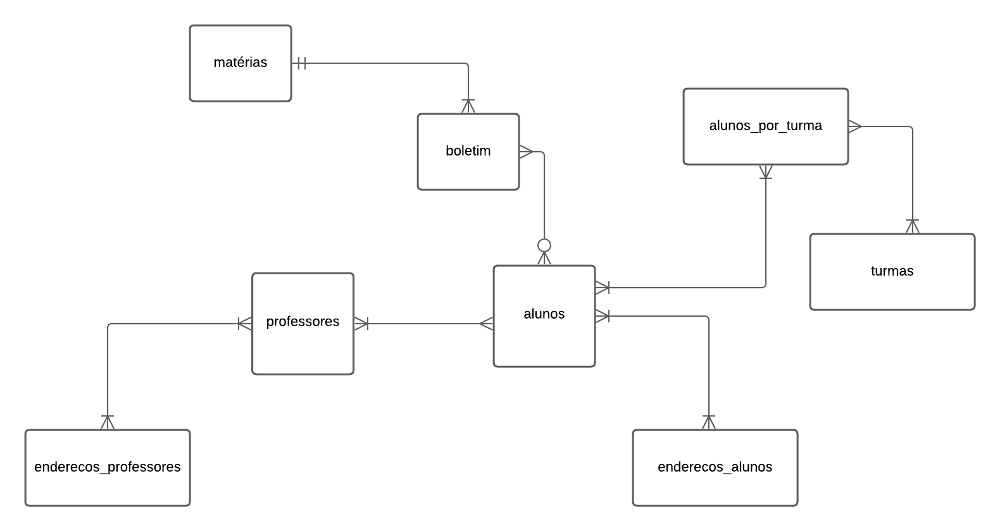

# Design Document

By Julielison Lima

Video overview: <https://www.youtube.com/watch?v=STuqSepd-ts>

## Scope

In this section you should answer the following questions:

* What is the purpose of your database?
The purpose of the database is to store and manage information about the teachers, students, subjects, and classes of a school.

* Which people, places, things, etc. are you including in the scope of your database?
The elements that are included in the scope of the database are: teachers, students, addresses, subjects, classes, report cards, and students per class.

* Which people, places, things, etc. are *outside* the scope of your database?
The elements that are outside the scope of the database are: employees, parents, coordinators, directors, schools, courses, subjects, grades, absences, and situation.

## Functional Requirements

In this section you should answer the following questions:

* What should a user be able to do with your database?
Insert, update and delete data in tables.
Query the information stored in tables and views.
Relate the data between tables using foreign keys.
Apply integrity and validation constraints on data using primary keys, checks and default values.
Create indexes to speed up queries.
Create views to simplify queries.

* What's beyond the scope of what a user should be able to do with your database?
Change the structure of tables or views.
Create other tables or views.
Create functions, procedures, triggers or events.
Create users, permissions or roles.
Backup or restore the database.'

## Representation

### Entities

In this section you should answer the following questions:

* Which entities will you choose to represent in your database?
- Students, students by class, newsletter, address of students and teachers, subjects, teachers, classes

* What attributes will those entities have?
- teachers: id, name, surname, area_of_training, degree_of_training, email, telephone, type_of_phone
- students: registration_id, name, surname, email, date_of_birth, telephone, telephone_type
- student_addresses: student_id, neighborhood, street, number, complement
- teacher_addresses: teacher_id, neighborhood, street, number, complement
- materials: id, name
- classes: id, class_letter, school_year, turn, series
- newsletter: student_id, subject_id, grade_p1, grade_p2, grade_p3, grade_p4, class_id, teacher_id, absences, situation
- students_by_class: class_id, student_id, status

* Why did you choose the types you did?
The types were chosen according to the nature of the data and compatibility with SQL. For example, attributes that store names, texts or emails were chosen as TEXT, those that store integers were chosen as INTEGER, those that store real numbers were chosen as REAL and those that store data were chosen as DATE.

* Why did you choose the constraints you did?
Constraints were chosen to ensure data integrity, validation, and consistency. For example, attributes that are primary keys were marked NOT NULL to avoid null values, attributes that are foreign keys were referenced to related tables to maintain referential integrity, attributes that have default values were marked DEFAULT to fill in the values missing, and attributes that have limited values have been marked with CHECK to validate the values entered.

### Relationships

## Optimizations

In this section you should answer the following questions:

* Which optimizations (e.g., indexes, views) did you create? Why?
Indexes for attributes that are frequently used in queries, such as id, subject_id, class_id, student_id, teacher_id, first name, last name, email, etc. This improves search performance by reducing data access time.
Views for queries that are frequently used or are complex, such as the students_turma_1 view, which displays all students in class 1. This simplifies the use of queries, as it avoids code repetition and facilitates maintenance.

## Limitations

In this section you should answer the following questions:

* What are the limitations of your design?
The possibility of a teacher or student having more than one address, telephone number or email address.
The possibility of a matter having more than one name or being divided into submaterials.
The possibility of a class having more than one letter, academic year, shift or series.
The possibility of a student or teacher changing their name, surname, area of training, degree, email, telephone number, type of telephone number, etc.

* What might your database not be able to represent very well?
a student's academic history
